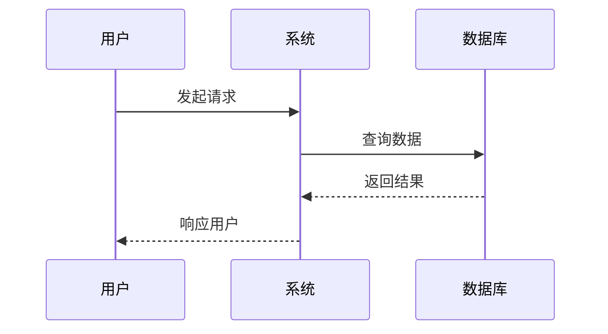

# 系统设计文档

## 1. 系统概述

### 1.1 系统目标
[描述系统的主要目标和预期成果]

### 1.2 系统范围
[定义系统的边界和约束]

### 1.3 设计原则
- 可扩展性
- 可维护性
- 高性能
- 安全性
- 可用性

## 2. 系统架构

### 2.1 架构概览
[提供系统整体架构图]

```
┌─────────────┐     ┌─────────────┐     ┌─────────────┐
│   前端层    │────▶│   服务层    │────▶│   数据层    │
└─────────────┘     └─────────────┘     └─────────────┘
```

### 2.2 技术栈选择
| 层级 | 技术选择 | 选择理由 |
|------|---------|----------|
| 前端 | | |
| 后端 | | |
| 数据库 | | |
| 缓存 | | |
| 消息队列 | | |

### 2.3 系统模块划分
```
系统
├── 用户模块
│   ├── 认证服务
│   ├── 授权服务
│   └── 用户管理
├── 业务模块
│   ├── 核心业务1
│   └── 核心业务2
└── 基础设施
    ├── 日志服务
    ├── 监控服务
    └── 配置中心
```

## 3. 详细设计

### 3.1 核心模块设计

#### 3.1.1 模块名称
- **职责**：
- **接口定义**：
- **依赖关系**：
- **数据流**：

### 3.2 数据模型设计

#### 3.2.1 ER图
[实体关系图]

#### 3.2.2 核心实体
```sql
-- 用户表
CREATE TABLE users (
    id BIGINT PRIMARY KEY,
    username VARCHAR(50) UNIQUE NOT NULL,
    email VARCHAR(100) UNIQUE NOT NULL,
    created_at TIMESTAMP DEFAULT CURRENT_TIMESTAMP
);
```

### 3.3 接口设计
[参见 API设计文档]

## 4. 系统流程

### 4.1 核心业务流程


### 4.2 异常处理流程
[描述系统异常处理机制]

## 5. 非功能性设计

### 5.1 性能设计
- **响应时间要求**：
- **并发处理能力**：
- **优化策略**：
  - 缓存策略
  - 数据库优化
  - 负载均衡

### 5.2 安全设计
- **认证机制**：
- **授权策略**：
- **数据加密**：
- **安全审计**：

### 5.3 可靠性设计
- **故障转移**：
- **数据备份**：
- **灾难恢复**：

### 5.4 扩展性设计
- **水平扩展方案**：
- **垂直扩展方案**：
- **微服务拆分策略**：

## 6. 部署架构

### 6.1 部署拓扑
```
生产环境
├── 负载均衡器 (2个)
├── 应用服务器 (4个)
├── 缓存服务器 (2个)
├── 数据库
│   ├── 主库 (1个)
│   └── 从库 (2个)
└── 监控服务器 (1个)
```

### 6.2 环境配置
| 环境 | 配置 | 用途 |
|------|------|------|
| 开发环境 | | 开发测试 |
| 测试环境 | | 集成测试 |
| 预发布环境 | | 上线前验证 |
| 生产环境 | | 正式服务 |

## 7. 监控与运维

### 7.1 监控指标
- 系统指标：CPU、内存、磁盘、网络
- 应用指标：QPS、响应时间、错误率
- 业务指标：用户活跃度、转化率

### 7.2 日志设计
- 日志级别：DEBUG, INFO, WARN, ERROR
- 日志格式：时间戳|级别|模块|消息
- 日志存储：集中式日志系统

## 8. 技术风险与对策

| 风险项 | 影响 | 对策 |
|--------|------|------|
| 单点故障 | 高 | 实施主从架构 |
| 数据一致性 | 中 | 使用分布式事务 |

## 9. 演进计划

### Phase 1: MVP版本
- 基础功能实现
- 单体架构

### Phase 2: 扩展版本
- 性能优化
- 功能增强

### Phase 3: 微服务化
- 服务拆分
- 容器化部署

---
*文档版本*：1.0  
*最后更新*：YYYY-MM-DD  
*架构师*：[姓名]