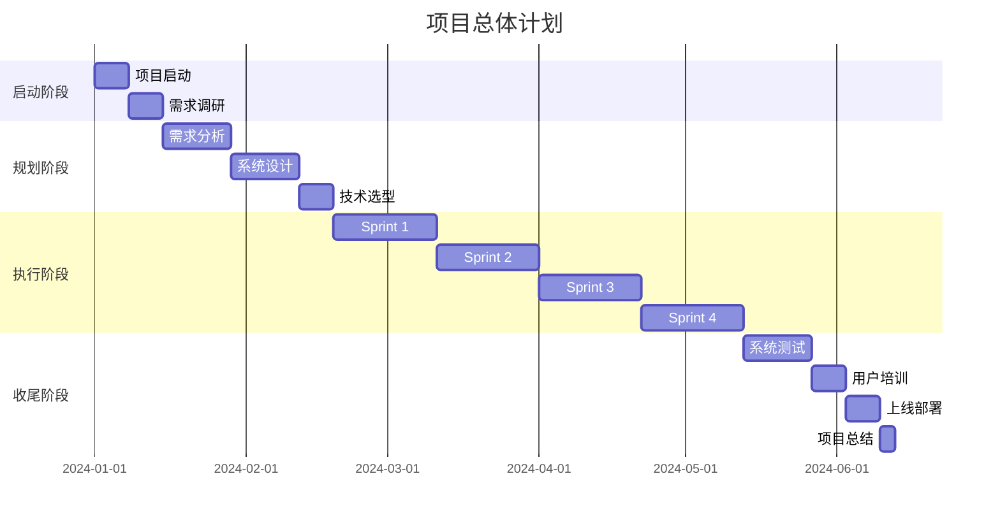

# 项目管理文档

## 1. 项目概述

### 1.1 项目基本信息
- **项目名称**：[项目名称]
- **项目代号**：[项目代号]
- **启动日期**：YYYY-MM-DD
- **预计完成日期**：YYYY-MM-DD
- **项目经理**：[姓名]
- **项目发起人**：[姓名]

### 1.2 项目背景
[描述项目的背景、业务需求和战略意义]

### 1.3 项目目标
- **业务目标**：
  1. [目标1]
  2. [目标2]
- **技术目标**：
  1. [目标1]
  2. [目标2]

### 1.4 项目范围
- **包含内容**：
  - [范围项1]
  - [范围项2]
- **排除内容**：
  - [排除项1]
  - [排除项2]

## 2. 项目组织

### 2.1 组织架构
```
项目指导委员会
    │
    ├── 项目经理
    │   ├── 技术负责人
    │   │   ├── 前端团队
    │   │   ├── 后端团队
    │   │   └── 测试团队
    │   ├── 产品负责人
    │   └── 运维负责人
```

### 2.2 角色与职责
| 角色 | 姓名 | 职责 | 联系方式 |
|------|------|------|---------|
| 项目经理 | | 整体项目管理、进度控制、风险管理 | |
| 技术负责人 | | 技术方案制定、技术难题解决 | |
| 产品负责人 | | 需求管理、产品设计 | |
| 前端负责人 | | 前端开发管理 | |
| 后端负责人 | | 后端开发管理 | |
| 测试负责人 | | 测试计划制定、质量保证 | |
| 运维负责人 | | 部署方案、运维支持 | |

### 2.3 沟通计划
| 会议类型 | 频率 | 参与人 | 时长 | 输出 |
|---------|------|--------|------|------|
| 日站会 | 每日 | 全体开发 | 15分钟 | 进度更新 |
| 周例会 | 每周一 | 核心团队 | 1小时 | 周报 |
| 迭代评审 | 双周 | 全体成员 | 2小时 | 评审记录 |
| 项目汇报 | 月度 | 管理层 | 1小时 | 汇报PPT |

## 3. 项目计划

### 3.1 项目阶段


### 3.2 里程碑计划
| 里程碑 | 计划日期 | 交付物 | 负责人 |
|--------|---------|--------|--------|
| M1: 需求确认 | YYYY-MM-DD | 需求规格说明书 | 产品经理 |
| M2: 设计完成 | YYYY-MM-DD | 系统设计文档 | 技术负责人 |
| M3: Alpha版本 | YYYY-MM-DD | 可运行的系统 | 开发团队 |
| M4: Beta版本 | YYYY-MM-DD | 功能完整的系统 | 开发团队 |
| M5: 正式发布 | YYYY-MM-DD | 生产环境系统 | 全体团队 |

### 3.3 工作分解结构(WBS)
```
1. 项目管理
   1.1 项目计划制定
   1.2 进度跟踪
   1.3 风险管理
   1.4 质量管理

2. 需求分析
   2.1 业务调研
   2.2 需求收集
   2.3 需求分析
   2.4 需求评审

3. 系统设计
   3.1 架构设计
   3.2 数据库设计
   3.3 接口设计
   3.4 UI/UX设计

4. 开发实施
   4.1 环境搭建
   4.2 前端开发
   4.3 后端开发
   4.4 集成联调

5. 测试验收
   5.1 单元测试
   5.2 集成测试
   5.3 系统测试
   5.4 用户验收测试

6. 部署上线
   6.1 部署准备
   6.2 生产部署
   6.3 数据迁移
   6.4 切换上线
```

## 4. 资源管理

### 4.1 人力资源计划
| 阶段 | 角色 | 人数 | 工作量(人天) |
|------|------|------|-------------|
| 需求分析 | 产品经理 | 2 | 20 |
| 系统设计 | 架构师 | 1 | 15 |
| 前端开发 | 前端工程师 | 3 | 180 |
| 后端开发 | 后端工程师 | 4 | 240 |
| 测试 | 测试工程师 | 2 | 60 |
| 部署 | 运维工程师 | 1 | 10 |

### 4.2 预算管理
| 类别 | 项目 | 预算(万元) | 实际(万元) | 差异 |
|------|------|-----------|-----------|------|
| 人力成本 | 开发人员 | 100 | - | - |
| 硬件成本 | 服务器 | 20 | - | - |
| 软件成本 | 许可证 | 10 | - | - |
| 其他成本 | 培训/差旅 | 5 | - | - |
| **总计** | | **135** | - | - |

## 5. 风险管理

### 5.1 风险识别与评估
| 风险ID | 风险描述 | 概率 | 影响 | 等级 | 责任人 |
|--------|---------|------|------|------|--------|
| R001 | 需求变更频繁 | 高 | 高 | 高 | 产品经理 |
| R002 | 技术难度超预期 | 中 | 高 | 高 | 技术负责人 |
| R003 | 关键人员离职 | 低 | 高 | 中 | 项目经理 |
| R004 | 第三方接口不稳定 | 中 | 中 | 中 | 技术负责人 |
| R005 | 上线时间延期 | 中 | 中 | 中 | 项目经理 |

### 5.2 风险应对计划
```markdown
风险ID: R001 - 需求变更频繁
应对策略: 缓解
具体措施:
1. 建立需求变更流程
2. 设置变更审批机制
3. 采用敏捷开发方法
4. 预留20%缓冲时间

风险ID: R002 - 技术难度超预期
应对策略: 缓解/转移
具体措施:
1. 提前进行技术预研
2. 引入外部技术专家
3. 准备备选技术方案
4. 加强团队技术培训
```

## 6. 质量管理

### 6.1 质量标准
- **代码质量**：
  - 代码覆盖率 > 80%
  - 代码复杂度 < 10
  - 无严重安全漏洞
- **性能标准**：
  - 响应时间 < 200ms (P95)
  - 可用性 > 99.9%
  - 并发用户 > 1000
- **文档标准**：
  - 所有模块有设计文档
  - API文档完整准确
  - 部署文档可执行

### 6.2 质量保证活动
| 活动 | 频率 | 负责人 | 输出 |
|------|------|--------|------|
| 代码评审 | 每次提交 | 技术负责人 | 评审记录 |
| 单元测试 | 持续 | 开发人员 | 测试报告 |
| 集成测试 | 每日 | 测试团队 | 测试报告 |
| 性能测试 | 每迭代 | 测试团队 | 性能报告 |
| 安全扫描 | 每周 | 安全团队 | 扫描报告 |

## 7. 变更管理

### 7.1 变更流程
```
变更请求 → 影响分析 → 变更评审 → 批准/拒绝 → 实施 → 验证
```

### 7.2 变更记录模板
```markdown
变更编号: CHG-001
请求日期: YYYY-MM-DD
请求人: [姓名]
变更类型: 需求变更/技术变更/计划变更
变更描述: [详细描述]
影响分析:
- 进度影响: [天数]
- 成本影响: [金额]
- 质量影响: [说明]
审批结果: 批准/拒绝
审批人: [姓名]
实施日期: YYYY-MM-DD
```

## 8. 进度跟踪

### 8.1 进度监控指标
- **计划完成率**: 已完成任务/计划任务 × 100%
- **实际进度偏差**: (实际进度 - 计划进度) / 计划进度 × 100%
- **里程碑达成率**: 已达成里程碑/计划里程碑 × 100%
- **燃尽图**: 跟踪剩余工作量

### 8.2 进度报告模板
```markdown
# 项目周报 - 第X周

## 本周完成工作
1. [完成事项1]
2. [完成事项2]

## 下周计划
1. [计划事项1]
2. [计划事项2]

## 风险与问题
1. [风险/问题描述]
   - 影响: [影响说明]
   - 措施: [应对措施]

## 关键指标
- 整体进度: XX%
- 本周计划完成: XX%
- 累计延期: X天
```

## 9. 知识管理

### 9.1 项目文档库
```
/项目文档
├── /01_项目管理
│   ├── 项目章程.docx
│   ├── 项目计划.mpp
│   └── 风险登记册.xlsx
├── /02_需求文档
│   ├── 需求规格说明书.docx
│   └── 原型设计.rp
├── /03_设计文档
│   ├── 系统架构设计.docx
│   └── 数据库设计.docx
├── /04_开发文档
│   ├── 开发规范.md
│   └── API文档.md
├── /05_测试文档
│   ├── 测试计划.docx
│   └── 测试报告.docx
└── /06_运维文档
    ├── 部署手册.md
    └── 运维手册.md
```

### 9.2 经验教训
- **最佳实践**：
  1. [实践1]
  2. [实践2]
- **问题与改进**：
  1. [问题1] → [改进建议]
  2. [问题2] → [改进建议]

## 10. 项目收尾

### 10.1 交付清单
- [ ] 源代码及文档
- [ ] 部署包
- [ ] 用户手册
- [ ] 运维手册
- [ ] 测试报告
- [ ] 项目总结报告

### 10.2 项目总结模板
```markdown
# 项目总结报告

## 项目概况
- 项目周期: XX天
- 总投入: XX人天
- 总成本: XX万元

## 目标达成情况
| 目标 | 计划 | 实际 | 达成率 |
|------|------|------|--------|
| 功能完成 | 100% | XX% | XX% |
| 质量标准 | 100% | XX% | XX% |
| 进度目标 | 100% | XX% | XX% |
| 成本控制 | 100% | XX% | XX% |

## 经验教训
### 成功经验
1. [经验1]
2. [经验2]

### 改进建议
1. [建议1]
2. [建议2]

## 团队表彰
[优秀团队成员表彰]
```

---
*文档版本*：1.0  
*最后更新*：YYYY-MM-DD  
*项目经理*：[姓名]