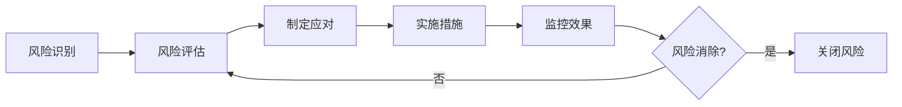

# 风险登记册

## 1. 风险管理概述

### 1.1 风险管理策略
- **风险识别**：持续识别项目全生命周期的风险
- **风险评估**：评估风险发生的概率和影响
- **风险应对**：制定风险应对策略和措施
- **风险监控**：跟踪风险状态和应对效果

### 1.2 风险等级定义
| 概率/影响 | 低(1) | 中(2) | 高(3) |
|-----------|-------|-------|-------|
| 高(3) | 中(3) | 高(6) | 极高(9) |
| 中(2) | 低(2) | 中(4) | 高(6) |
| 低(1) | 低(1) | 低(2) | 中(3) |

## 2. 风险清单

### 2.1 技术风险

#### RISK-001: 新技术学习曲线
- **类别**：技术风险
- **描述**：团队对选用的新技术栈不熟悉，可能导致开发效率低下
- **触发条件**：技术方案确定后，团队反馈学习困难
- **概率**：中(2)
- **影响**：高(3)
- **风险等级**：高(6)
- **责任人**：技术负责人
- **应对策略**：缓解
- **应对措施**：
  1. 安排技术培训和分享会
  2. 引入有经验的技术顾问
  3. 建立技术问题知识库
  4. 预留额外的开发时间
- **状态**：活跃
- **更新日期**：YYYY-MM-DD

#### RISK-002: 系统集成复杂度
- **类别**：技术风险
- **描述**：多个子系统集成可能出现兼容性问题
- **概率**：中(2)
- **影响**：中(2)
- **风险等级**：中(4)
- **应对策略**：缓解
- **应对措施**：
  1. 提前定义清晰的接口规范
  2. 建立持续集成环境
  3. 增加集成测试的投入

### 2.2 需求风险

#### RISK-003: 需求变更频繁
- **类别**：需求风险
- **描述**：业务部门可能频繁调整需求，影响项目进度
- **概率**：高(3)
- **影响**：高(3)
- **风险等级**：极高(9)
- **应对策略**：缓解
- **应对措施**：
  1. 建立需求变更控制流程
  2. 采用敏捷开发方法
  3. 设置需求冻结期
  4. 与业务部门签订需求确认书

#### RISK-004: 需求理解偏差
- **类别**：需求风险
- **描述**：开发团队对业务需求理解不准确
- **概率**：中(2)
- **影响**：中(2)
- **风险等级**：中(4)
- **应对措施**：
  1. 加强需求评审
  2. 使用原型进行需求确认
  3. 保持与业务部门的密切沟通

### 2.3 资源风险

#### RISK-005: 关键人员离职
- **类别**：资源风险
- **描述**：项目关键技术人员可能离职
- **概率**：低(1)
- **影响**：高(3)
- **风险等级**：中(3)
- **应对策略**：缓解/转移
- **应对措施**：
  1. 建立知识共享机制
  2. 避免单点依赖
  3. 准备人员备份计划
  4. 提供有竞争力的激励

#### RISK-006: 外部资源延期
- **类别**：资源风险
- **描述**：外部供应商或合作方交付延期
- **概率**：中(2)
- **影响**：中(2)
- **风险等级**：中(4)
- **应对措施**：
  1. 提前沟通确认交付时间
  2. 准备备选供应商
  3. 在合同中明确违约责任

### 2.4 进度风险

#### RISK-007: 开发进度延误
- **类别**：进度风险
- **描述**：由于各种原因导致开发进度落后于计划
- **概率**：中(2)
- **影响**：高(3)
- **风险等级**：高(6)
- **应对措施**：
  1. 预留20%的缓冲时间
  2. 采用并行开发策略
  3. 定期进行进度评审
  4. 及时调整资源分配

### 2.5 质量风险

#### RISK-008: 测试覆盖不足
- **类别**：质量风险
- **描述**：测试用例覆盖不全面，导致缺陷遗漏
- **概率**：中(2)
- **影响**：高(3)
- **风险等级**：高(6)
- **应对措施**：
  1. 制定详细的测试计划
  2. 引入自动化测试
  3. 进行代码审查
  4. 增加测试资源投入

### 2.6 外部风险

#### RISK-009: 政策法规变化
- **类别**：外部风险
- **描述**：相关法规政策变化影响系统设计
- **概率**：低(1)
- **影响**：高(3)
- **风险等级**：中(3)
- **应对策略**：接受/监控
- **应对措施**：
  1. 持续关注政策动向
  2. 设计灵活可配置的系统
  3. 保持与法务部门沟通

## 3. 风险应对策略

### 3.1 策略类型
- **规避**：改变项目计划以消除风险
- **转移**：将风险转移给第三方
- **缓解**：降低风险发生的概率或影响
- **接受**：承认风险存在但不采取主动措施

### 3.2 应急储备
- **进度储备**：总工期的15-20%
- **成本储备**：总预算的10-15%
- **资源储备**：关键岗位20%的后备人员

## 4. 风险监控

### 4.1 监控机制


### 4.2 风险报告模板
```markdown
# 风险状态报告 - YYYY-MM-DD

## 新增风险
- [风险ID]: [风险描述]

## 风险状态更新
| 风险ID | 当前状态 | 概率变化 | 影响变化 | 已采取措施 |
|--------|---------|---------|---------|-----------|
| | | ↑/↓/- | ↑/↓/- | |

## 已关闭风险
- [风险ID]: [关闭原因]

## 需要关注的风险
1. [风险ID]: [需要采取的行动]
```

## 5. 风险跟踪矩阵

| 风险ID | 风险名称 | 状态 | 当前概率 | 当前影响 | 风险值 | 趋势 | 最后更新 |
|--------|---------|------|---------|---------|--------|------|---------|
| RISK-001 | 新技术学习曲线 | 活跃 | 中(2) | 高(3) | 6 | ↓ | YYYY-MM-DD |
| RISK-002 | 系统集成复杂度 | 活跃 | 中(2) | 中(2) | 4 | - | YYYY-MM-DD |
| RISK-003 | 需求变更频繁 | 活跃 | 高(3) | 高(3) | 9 | ↑ | YYYY-MM-DD |
| RISK-004 | 需求理解偏差 | 缓解中 | 低(1) | 中(2) | 2 | ↓ | YYYY-MM-DD |
| RISK-005 | 关键人员离职 | 监控中 | 低(1) | 高(3) | 3 | - | YYYY-MM-DD |

## 6. 历史风险库

### 6.1 已发生风险
| 风险描述 | 发生时间 | 实际影响 | 应对效果 | 经验教训 |
|---------|---------|---------|---------|----------|
| 数据库性能问题 | YYYY-MM-DD | 延期3天 | 成功解决 | 需提前进行性能测试 |

### 6.2 已关闭风险
| 风险ID | 风险名称 | 关闭日期 | 关闭原因 |
|--------|---------|---------|----------|
| RISK-010 | 供应商交付风险 | YYYY-MM-DD | 已签订合同，风险转移 |

## 7. 风险会议记录

### 7.1 风险评审会议模板
```markdown
会议时间: YYYY-MM-DD HH:MM
参会人员: [列表]
会议议题: 项目风险评审

讨论内容:
1. 新识别的风险
2. 现有风险状态更新
3. 风险应对措施效果

决议事项:
1. [决议1]
2. [决议2]

行动计划:
| 行动项 | 负责人 | 完成时间 |
|--------|--------|---------|
| | | |

下次会议: YYYY-MM-DD
```

---
*文档版本*：1.0  
*最后更新*：YYYY-MM-DD  
*风险管理员*：[姓名]