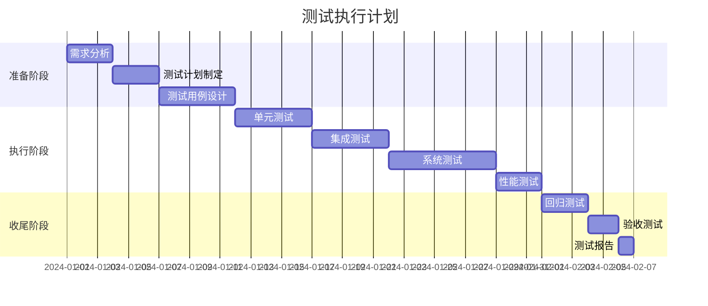

# 测试计划文档

## 1. 测试概述

### 1.1 测试目标
- 确保软件质量满足需求规格
- 发现并报告软件缺陷
- 验证功能的正确性和完整性
- 评估系统性能和可靠性

### 1.2 测试范围
#### 包含范围
- 功能测试
- 性能测试
- 安全测试
- 兼容性测试
- 用户体验测试

#### 排除范围
- [明确不在测试范围内的功能或模块]

### 1.3 测试策略
- **测试方法**：黑盒测试、白盒测试、灰盒测试
- **测试级别**：单元测试、集成测试、系统测试、验收测试
- **自动化策略**：UI自动化、API自动化、性能自动化

## 2. 测试资源

### 2.1 人员安排
| 角色 | 人员 | 职责 |
|------|------|------|
| 测试经理 | [姓名] | 测试计划制定、进度管理 |
| 测试工程师 | [姓名] | 用例设计、执行测试 |
| 自动化工程师 | [姓名] | 自动化脚本开发 |
| 性能测试工程师 | [姓名] | 性能测试执行 |

### 2.2 测试环境
| 环境类型 | 配置 | 用途 | 访问地址 |
|---------|------|------|---------|
| 开发环境 | 2核4G | 开发自测 | dev.example.com |
| 测试环境 | 4核8G | 功能测试 | test.example.com |
| 预发布环境 | 8核16G | 回归测试 | staging.example.com |
| 性能测试环境 | 16核32G | 性能测试 | perf.example.com |

### 2.3 测试工具
| 工具类型 | 工具名称 | 用途 |
|---------|---------|------|
| 测试管理 | JIRA/TestRail | 用例管理、缺陷跟踪 |
| 自动化测试 | Selenium/Pytest | UI/API自动化 |
| 性能测试 | JMeter/Locust | 压力测试、负载测试 |
| 安全测试 | OWASP ZAP | 安全漏洞扫描 |
| 代码质量 | SonarQube | 代码质量分析 |

## 3. 测试计划

### 3.1 测试阶段


### 3.2 测试里程碑
| 里程碑 | 日期 | 交付物 |
|--------|------|--------|
| 测试计划评审 | YYYY-MM-DD | 测试计划文档 |
| 测试用例评审 | YYYY-MM-DD | 测试用例文档 |
| 第一轮测试完成 | YYYY-MM-DD | 测试报告v1 |
| 回归测试完成 | YYYY-MM-DD | 回归测试报告 |
| 测试结束 | YYYY-MM-DD | 最终测试报告 |

## 4. 测试用例设计

### 4.1 功能测试用例
```markdown
测试用例ID: TC_001
测试模块: 用户登录
测试标题: 正常登录测试
优先级: P0
前置条件: 用户已注册

测试步骤:
1. 打开登录页面
2. 输入正确的用户名和密码
3. 点击登录按钮

预期结果:
- 登录成功，跳转到首页
- 显示用户信息
- 生成有效的会话Token
```

### 4.2 测试用例分类
| 类别 | 用例数量 | 优先级分布 |
|------|---------|-----------|
| 功能测试 | 200 | P0:50, P1:100, P2:50 |
| 接口测试 | 150 | P0:40, P1:80, P2:30 |
| 性能测试 | 20 | P0:10, P1:10 |
| 安全测试 | 30 | P0:20, P1:10 |

### 4.3 测试数据准备
```sql
-- 测试数据初始化脚本
INSERT INTO test_users (username, email, password_hash) VALUES
('test_user_1', 'test1@example.com', 'hashed_password_1'),
('test_user_2', 'test2@example.com', 'hashed_password_2'),
('test_user_3', 'test3@example.com', 'hashed_password_3');
```

## 5. 具体测试类型

### 5.1 功能测试
- **测试方法**：基于需求的黑盒测试
- **覆盖率目标**：>95%
- **自动化率**：>80%

### 5.2 性能测试

#### 5.2.1 性能指标
| 指标 | 目标值 | 测试场景 |
|------|--------|---------|
| 响应时间 | <200ms (P95) | 单用户场景 |
| 吞吐量 | >1000 TPS | 并发100用户 |
| 错误率 | <0.1% | 压力测试 |
| CPU使用率 | <70% | 峰值负载 |

#### 5.2.2 性能测试脚本
```python
# Locust性能测试脚本示例
from locust import HttpUser, task, between

class WebsiteUser(HttpUser):
    wait_time = between(1, 3)
    
    @task
    def login(self):
        self.client.post("/api/login", json={
            "username": "test_user",
            "password": "test_password"
        })
    
    @task(3)
    def view_items(self):
        self.client.get("/api/items")
```

### 5.3 安全测试
- SQL注入测试
- XSS跨站脚本测试
- CSRF跨站请求伪造测试
- 认证授权测试
- 敏感数据泄露测试

### 5.4 兼容性测试

#### 5.4.1 浏览器兼容性
| 浏览器 | 版本 | 测试结果 |
|--------|------|---------|
| Chrome | 最新版及前两个版本 | ✓ |
| Firefox | 最新版及前一个版本 | ✓ |
| Safari | 最新版 | ✓ |
| Edge | 最新版 | ✓ |

#### 5.4.2 移动端兼容性
| 设备类型 | 操作系统 | 测试结果 |
|---------|---------|---------|
| iPhone | iOS 14+ | ✓ |
| Android | Android 10+ | ✓ |
| iPad | iPadOS 14+ | ✓ |

## 6. 缺陷管理

### 6.1 缺陷分级
| 级别 | 定义 | 响应时间 | 示例 |
|------|------|---------|------|
| P0-致命 | 系统崩溃、数据丢失 | 立即 | 应用无法启动 |
| P1-严重 | 主要功能无法使用 | 4小时内 | 无法登录 |
| P2-一般 | 次要功能异常 | 1个工作日 | 界面显示错误 |
| P3-轻微 | 体验问题 | 2个工作日 | 文字错误 |

### 6.2 缺陷生命周期
```
新建 → 分配 → 修复中 → 待验证 → 关闭
         ↓        ↓         ↓
      重新打开 ← 拒绝  ← 验证失败
```

### 6.3 缺陷报告模板
```markdown
缺陷ID: BUG-001
标题: [模块]简要描述问题
严重程度: P0/P1/P2/P3
发现版本: v1.0.0

环境信息:
- 操作系统：
- 浏览器版本：
- 测试环境：

重现步骤:
1. 步骤一
2. 步骤二
3. 步骤三

实际结果:
[描述实际发生的情况]

预期结果:
[描述期望的结果]

附件:
- 截图
- 日志
- 视频
```

## 7. 风险评估

### 7.1 测试风险
| 风险项 | 影响 | 概率 | 缓解措施 |
|--------|------|------|----------|
| 需求变更频繁 | 高 | 高 | 敏捷测试、自动化测试 |
| 测试时间不足 | 高 | 中 | 优先级排序、风险测试 |
| 环境不稳定 | 中 | 中 | 环境监控、备用环境 |
| 测试数据不足 | 低 | 低 | 数据生成工具 |

## 8. 测试准入准出标准

### 8.1 测试准入标准
- [ ] 需求文档已评审通过
- [ ] 开发自测完成
- [ ] 代码已提交并通过编译
- [ ] 测试环境已准备就绪
- [ ] 测试数据已准备完成

### 8.2 测试准出标准
- [ ] 所有P0、P1用例执行通过
- [ ] P2用例通过率>95%
- [ ] 无P0、P1级别未关闭缺陷
- [ ] 性能指标满足要求
- [ ] 安全测试无高危漏洞

## 9. 测试度量

### 9.1 测试指标
- **需求覆盖率**: 测试用例覆盖的需求数/总需求数
- **用例执行率**: 已执行用例数/计划执行用例数
- **缺陷密度**: 缺陷数/代码行数(KLOC)
- **缺陷修复率**: 已修复缺陷数/总缺陷数
- **自动化覆盖率**: 自动化用例数/总用例数

### 9.2 测试报告
```markdown
# 测试报告模板

## 测试概况
- 测试周期：YYYY-MM-DD 至 YYYY-MM-DD
- 测试版本：v1.0.0
- 测试范围：[功能模块列表]

## 测试执行情况
| 测试类型 | 计划用例 | 执行用例 | 通过用例 | 失败用例 | 通过率 |
|---------|---------|---------|---------|---------|--------|
| 功能测试 | 200 | 200 | 195 | 5 | 97.5% |
| 性能测试 | 20 | 20 | 18 | 2 | 90% |

## 缺陷统计
| 严重级别 | 新增 | 修复 | 遗留 |
|---------|------|------|------|
| P0 | 2 | 2 | 0 |
| P1 | 10 | 9 | 1 |
| P2 | 20 | 15 | 5 |
| P3 | 8 | 5 | 3 |

## 测试结论
[通过/不通过/有条件通过]

## 遗留问题
1. [问题描述及影响]
2. [问题描述及影响]
```

## 10. 持续改进

### 10.1 测试回顾会议
- 召开时间：每个迭代结束后
- 参与人员：测试团队、开发团队、产品团队
- 会议内容：
  - 测试过程问题总结
  - 改进建议收集
  - 最佳实践分享

### 10.2 改进措施
- 提高自动化测试覆盖率
- 优化测试用例设计
- 改进缺陷管理流程
- 加强测试工具使用培训

---
*文档版本*：1.0  
*最后更新*：YYYY-MM-DD  
*测试经理*：[姓名]